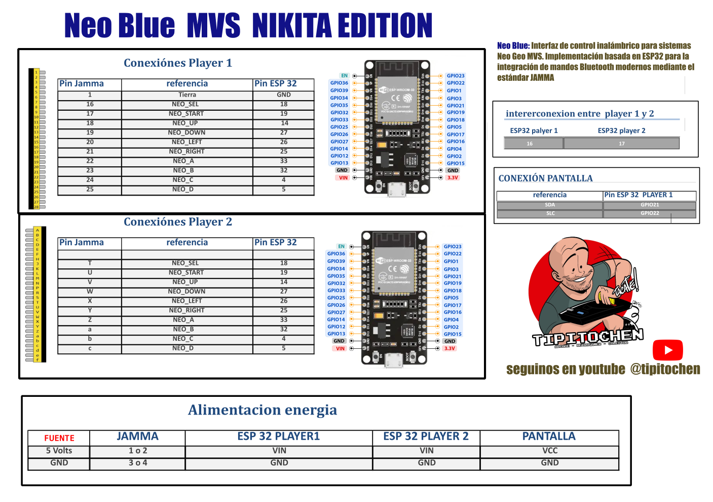

NEO BLUE: Direct PS5 Controller Interface for Neo Geo MVS

NEO BLUE es un proyecto de hardware minimalista diseñado para habilitar el uso de mandos DualSense (PS5) en sistemas arcade SNK Neo Geo MVS.

A diferencia de otras interfaces complejas, NEO BLUE aprovecha la tolerancia de voltaje de los módulos ESP32 modernos para realizar una conexión directa y eficiente entre el Bluetooth HID y el estándar JAMMA/MVS, reduciendo la cantidad de componentes necesarios y simplificando el montaje.
Características del Proyecto:

    Conexión Directa (5V Compliant): Implementación optimizada para placas ESP32 con soporte de 5V, eliminando la necesidad de integrados de aislamiento externos.

    Dual-Core Multi-Player: Sistema de dos unidades ESP32 interconectadas por Serial (Pines 16/17) para habilitar controles independientes para Jugador 1 y Jugador 2.

    Baja Latencia: Basado en la librería Bluepad32, garantizando una respuesta casi instantánea ideal para juegos de lucha y acción.

    Interfaz Visual: Soporte para pantalla LCD 20x4 (I2C) que muestra el estado de emparejamiento, el nombre del proyecto ("NIKITA") y diagnósticos del sistema.

Ventajas de este enfoque:

    Menor Tamaño: El PCB o el cableado final es mucho más pequeño, ideal para integrar dentro de una carcasa de MVS o una Supergun.

    Simplicidad: Facilita que otros usuarios con conocimientos básicos de electrónica puedan replicar el proyecto rápidamente.

🛠️ Lista de Componentes (Bill of Materials)

Para replicar el proyecto NEO BLUE con soporte para dos jugadores y visualización de estado, necesitarás lo siguiente:
1. Microcontroladores

    2x ESP32 DevKit V1 (30 o 38 pines): Se utilizan dos unidades para gestionar ambos jugadores de forma independiente y garantizar la estabilidad del Bluetooth.

        Nota: Asegúrate de usar versiones modernas que soporten la lógica de 5V de los sistemas arcade en sus entradas/salidas.

2. Interfaz Visual

    1x Pantalla LCD 20x4 con módulo I2C: Para mostrar el estado de conexión de "Player 1" y "Player 2", además del nombre del proyecto.

        Dirección I2C común: 0x3F o 0x27.

3. Conectividad Arcade (Salidas)

    Cableado para peine JAMMA / Conector MVS: Cables para llevar las señales de los GPIO del ESP32 directamente a los pines de la placa Neo Geo.

        Direcciones: Arriba, Abajo, Izquierda, Derecha.

        Botones: A, B, C, D (y opcionalmente Select/Start).

4. Comunicación y Alimentación

    Cables de salto (Jumper Wires): Para la conexión Serial entre los dos ESP32 (Pines TX/RX 16 y 17) y la línea I2C del LCD.

    Fuente de alimentación de 5V: Puedes tomar los 5V directamente de la fuente de poder de tu sistema arcade o Supergun para alimentar los ESP32 y el LCD.

5. Periféricos (Mandos)

    1 o 2 Mandos Sony DualSense (PS5): Compatibles mediante la librería Bluepad32 integrada en el código.

Diagrama de conexiones :

  

💻 Software y Librerías Requeridas

Para compilar este proyecto en el IDE de Arduino, asegúrate de tener instaladas las siguientes dependencias:

    Bluepad32: La librería principal para la gestión de los mandos DualSense/PS5 vía Bluetooth.

    LiquidCrystal_I2C: Para el manejo de la pantalla LCD 20x4 (Dirección 0x3F).

    Wire.h: Librería estándar para la comunicación I2C entre el ESP32 y el display.

🤝 Agradecimientos / Credits

Este proyecto no habría sido posible sin el increíble trabajo de la comunidad de código abierto. Un agradecimiento especial a:

    Ricardo Quesada: Creador de la librería Bluepad32. Gracias por desarrollar el stack de Bluetooth que permite que mandos como el DualSense funcionen con tanta fluidez en el ESP32. Su trabajo es la base que permite que NEO BLUE cobre vida.

    A todos los desarrolladores de la comunidad de retro-gaming y arcade modding que comparten sus conocimientos sobre los estándares JAMMA y MVS.
📺 Casi Tutoriales y Demostraciones

Si quieres ver el proyecto Neo Blue funcionando en una placa Neo Geo MVS real o necesitas una guía paso a paso sobre el montaje, visita mi canal de YouTube:

👉 Canal Oficial: Tipitochen en YouTube

y si señores ... tenia que ser .. Nikita! 
    
